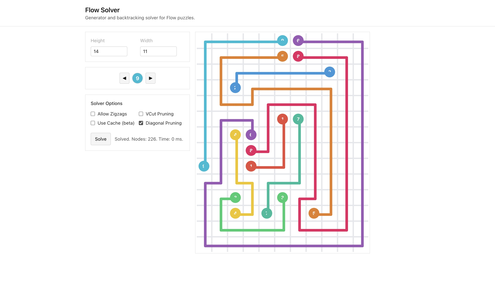

<div align="center">

# Flow Solver

Generator and backtracking solver for Flow puzzles.

</div>

## Overview

Parses a grid of integers where positive numbers denote colored endpoints (each color appears twice) and zeros are empty cells, then finds non‑overlapping paths connecting equal numbers so that non‑endpoints have degree 2 and endpoints have degree 1.



**Status:** Solver and generator are functional; some heuristics are experimental or disabled.

## Repository Structure

- `src/main.rs`: Entry point. Parses CLI (`gen`/`solve`) and dispatches.
- `src/search/`: Solver implementation.
  - `mod.rs`: `SearchFlow` state machine and DFS search. Applies degree constraints, prunes illegal zigzags, optional diagonal heuristics, and uses a rollbackable DSU.
  - `link.rs`: Link semantics for DSU unification across grid cells, tracking colored/uncolored/complete components.
  - `modnum.rs`: Lightweight modular arithmetic helper (used for hashing; table currently disabled).
- `src/dsu.rs`: Undoable Union‑Find with per‑set payload and operation history, supporting efficient `undo()` during DFS.
- `src/gen.rs`: Random puzzle generator. Builds a valid set of paths, marks some vertices as heads, and emits a board via connected‑component labeling.
- `src/matching.rs`: Simple Kuhn bipartite matching (currently unused).
- `puzzles/`: Example and generated puzzle inputs (whitespace‑separated integers).
  - Examples: `spiral.txt`, `ext_rectangle_60.txt`, `mzucker_final.txt`, plus generated `NxN_generated_0.txt` files.
- `Cargo.toml`, `Cargo.lock`: Rust package configuration and lockfile.

## Puzzle File Format

- Layout: Plain text, rows separated by newlines, cells separated by spaces.
- Cell values:
  - `0`: empty cell
  - `k > 0`: endpoint (aka head) of color `k` (each `k` appears exactly twice)
- Dimensions: The grid is rectangular; all rows must have the same number of entries.

## CLI Usage

```sh
# Solve an existing puzzle file
cargo run -- solve <input_file>

# Generate a new puzzle and write it to a file
cargo run -- gen <height> <width> <output_file>
```

Examples:

```sh
cargo run --release -- solve puzzles/spiral.txt
cargo run --release -- gen 50 50 puzzles/50x50_generated_0.txt
```

### Solve Options

- `input_file`: Path to the puzzle file to solve (required).
- `--output <PATH>`: Write the solved grid and stats to a file (default: print to stdout only).
- `--log-period <N>`: Log search progress every N nodes (default: 1,000,000). Ignored if `--no-log` is set.
- `--no-log`: Disable periodic logging entirely.
- `--rotation <0..3>`: Rotate the input board counter‑clockwise this many times before solving (default: 0).
- `--allow-zigzag`: Allow local zigzag patterns (default: off).
- `--use-table`: Enable state deduplication table (default: off; currently marked broken).
- `--use-vcut`: Enable vertical‑cut heuristic (default: off).
- `--no-diagonals`: Disable diagonal head‑count pruning (default: enabled).

### Gen Options

- `height`: Height of the generated board (required).
- `width`: Width of the generated board (required).
- `output_file`: Where to write the generated puzzle (required).
- `--allow-zigzag`: Allow zigzags during generation (default: off).

## Web App

Run a local web UI to build puzzles interactively and solve them in the browser.

```sh
cargo run --bin server
# then open http://127.0.0.1:3000
```